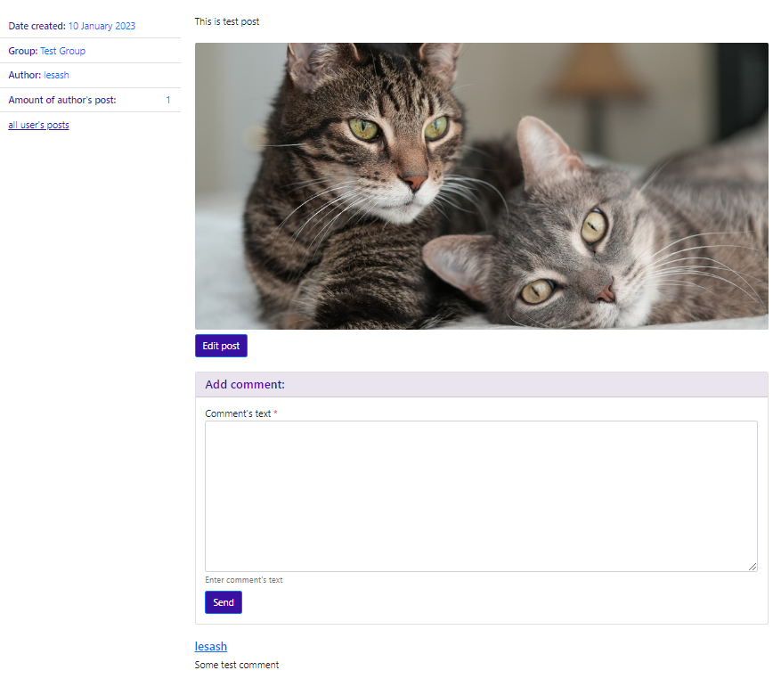

# Social network Python App backend example (Django)

Using SQLite as DB, backend based on model-views approach.
Backend performs next modules:

* Post: can create new posts with images and text or edit/delete existing ones
* Group: can set post to specific group and render all posts from exact group
* Follow: can follow or unfollow author
* Comment: Can add comments on post and see all added posts
* Admin: custom administration module for superuser




### Built With

* [![Python][Python.io]][Python-url]
* [![Django][Django.io]][Django-url]
* [![SqlLite][SqlLite.io]][SqlLite-url]
* [![Pytest][Pytest.io]][Pytest-url]

## Pre-installations

#### Clone the repo:

```sh
git clone https://github.com/AdeleDev/social_network_python_app.git
```

#### Start and activate virtual environment:

```sh
python3 -m venv env
```

```sh
source env/bin/activate
```

#### Setup dependencies from requirements.txt file:

```sh
python3 -m pip install --upgrade pip
```

```sh
pip install -r requirements.txt
```

## Usage

#### Do migrations:

```sh
python3 manage.py migrate
```

#### Create superuser:

```sh
python3 manage.py createsuperuser
```

#### Run project:

Navigate to http://localhost:8000/

For admin console: to http://localhost:8000/admin

```sh
cd yatype
python3 manage.py runserver
```

<!-- MARKDOWN LINKS & IMAGES -->

[Python.io]: https://img.shields.io/badge/-Python-yellow?style=for-the-badge&logo=python

[Python-url]: https://www.python.org/

[Django.io]: https://img.shields.io/badge/-Django-darkgreen?style=for-the-badge&logo=django

[Django-url]: https://www.djangoproject.com/

[SqlLite.io]: https://img.shields.io/badge/-SQLite-blue?style=for-the-badge&logo=sqlite

[SqlLite-url]: https://www.sqlite.org/index.html

[Pytest.io]: https://img.shields.io/badge/-Pytest-lightblue?style=for-the-badge&logo=pytest

[Pytest-url]: https://docs.pytest.org/en/7.2.x/